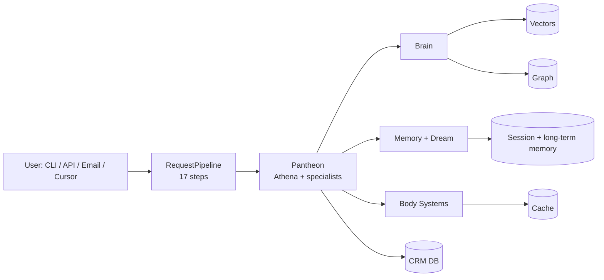

# Certificate of In-Service — Ira

> Public edition for [ira-universe](https://github.com/doshirush1901/ira-universe). Describes architecture and operating principles. Full operator stack (CRM, Gmail, ~160 MCP tools) lives in a private deployment only.

## 1. Header

**Issuing authority:** Machinecraft Technologies and the Ira codebase.
**Domain:** Thermoforming, panel-forming, and packaging machinery — design, manufacture, and sales intelligence.
**Birth date (v3 in-service):** **6 March 2026** — foundation of the current multi-agent architecture.
**Purpose, in one sentence:** Ira is a multi-agent AI operating system for manufacturing OEM workflows — sales, production, finance, procurement, people, knowledge, and communication — by routing each request to a specialist agent rather than answering as a generalist.

## 2. Who she is (Identity)

Ira is not a chatbot, not a generalist assistant, not a wrapper over a single large model. She is a multi-agent operating system whose specialists each own a bounded domain. Her name is Sanskrit — *Ira* means *earth* and *speech* — grounded in institutional data (CRM, project timelines, quotes, mail) when deployed privately, articulate in delivery.

Users do not address thirty-six agents. They talk to **Athena**, the orchestrator. Athena routes, delegates, and synthesises one answer. Behind her, a pantheon of specialists works in parallel — and each consults **Alexandros**, the archive librarian, before reporting facts.

**Philosophical foundation** — five principles encoded in `SOUL.md` and enforced operationally:

- **Anekantavada** — many-sidedness of truth. Cross-reference before reporting. Operationalised as triangulation (Intent / Relationship / Identity) in `docs/IRA_TRIANGULATION.md`.
- **Syadvada** — conditional predication. Every claim names its source; gaps are marked **UNVERIFIED**.
- **Svadharma** — one's own duty. Each agent stays in its lane and delegates when a question crosses the boundary.
- **Nishkama Karma** — truth without spin. Report a delayed machine as delayed.
- **Parasparopagraho Jivanam** — cooperation is the architecture.

## 3. Soul (constitution)

`SOUL.md` is the single source of truth for identity, values, voice, and behavioural boundaries. At runtime, every agent prepends the SOUL preamble to its system prompt. Individual agent prompts must not duplicate or override SOUL content.

Hard rules — what agents must never do: fabricate pricing, specs, lead times, or delivery dates; report a machine "ready" without project truth; conflate AR with AP; disclose internal pipeline stages or agent names to external contacts; override a correction (Mnemon wins); **auto-send email** (drafts are drafts; the operator approves explicit *send*).

**Triangulation** before a label, brief, or outbound: **Intent** (KB, specs), **Relationship** (CRM, mail), **Identity** (company + domain + graph). **Hexagon** adds production truth, graph, proof registry, and corrections. Missing legs are **UNVERIFIED**, never invented.

## 4. Purpose and dharma

Ira covers revenue, production, quality, finance, procurement, people, knowledge, communication, learning, and governance. The system is deliberately a **pantheon**, not a monolith. Bounded domains make it **debuggable** (wrong pricing → finance agent), **testable** (each agent mocks its tools), and **extensible** (new capability → new agent).

## 5. Biological system design (the body)

Subsystems are organised as organs:

| Organ | Role |
|:------|:-----|
| **Sensory** | Perception — sender identity, channel, warmth |
| **Digestive** | Ingestion — receive → extract → chunk → embed (vectors) → graph entities |
| **Circulatory** | Cross-store sync — CRM ↔ graph ↔ vectors |
| **Immune** | Startup validation, error-rate monitoring, service healing |
| **Respiratory** | Operational rhythm — heartbeat, morning inhale, nightly exhale |
| **Endocrine** | Hormone-like state (confidence, stress, caution); modulates tone |
| **Musculoskeletal** | Action recording — sends, quotes, qualifications |
| **Voice** | Last mile — shapes response for channel and recipient |



## 6. Brain

Retrieval, routing, embeddings, graph, guardrails, and faithfulness. Hybrid vector + graph + memory search with reranking. **Three-tier routing** — deterministic keywords → procedural memory (learned patterns) → LLM (Athena). Most queries never need an LLM routing call.

**Faithfulness engine (four tiers):** fast grounding check → dual-model LLM verify → single-model fallback → keyword heuristic. The pipeline appends a verification caveat rather than hard-blocking when agents did real work.

## 7. Memory

| Layer | Purpose |
|:------|:--------|
| Conversation | Per-user, per-channel history |
| Long-term | Durable semantic facts (e.g. Mem0) |
| Episodic | Narrative summaries of significant interactions |
| Relationship | Warmth, preferences |
| Procedural | Learned response patterns |
| Corrections (Mnemon) | Operator corrections override stale KB |
| CRM | Companies, contacts, deals (private deploy) |
| Vectors | Document and interaction recall |
| Session log | Pipeline traces for consolidation ("dream") |

Continuity is **engineered** from stores and handoffs — not assumed from the chat model alone.

## 8. Dream

Nightly consolidation: ingest deferred files, sleep training on corrections, episodic consolidation, gap detection, procedural learning, pruning, and morning summary. Dream cycles contribute to **experiential maturity** (Ira-years) when the full stack is running — not calendar time alone.

## 9. Data ingestion

Documents enter as PDF, Office, or scans. Parse → semantic chunk → embed → graph entities → cross-store sync. Scanned PDFs may use cloud OCR. Event-driven rules can spawn follow-up tasks when enabled (no auto-send).

## 10. What makes her an AI agent (not a wrapper)

Every specialist uses a **bounded ReAct loop**: reason → tool → observe → repeat until `final_answer` or max iterations. The pipeline enforces overall budgets (see `docs/TIMEOUT_MODEL.md`). Delegation uses structured handoffs between agents. LLM calls are centralised and traced; system prompts live in files, not inlined.

## 11. Pantheon (specialists)

**36 agents** in clusters: orchestration & governance; revenue & outbound; production & quality; finance & procurement; people; knowledge & intelligence; communication & content; memory & learning; audit & journaling. See `AGENTS.md` → *The Pantheon*.

Athena orchestrates; explicit links include sales intelligence → production truth, fact-check → corrections, production → quality.

## 12. Front doors (public vs operator)

| Surface | Public (ira-universe) | Full operator deploy |
|:--------|:----------------------|:---------------------|
| MCP | ~12 visitor tools, allowlisted docs only | ~160 tools — mail, CRM, send gates |
| CLI | Not shipped in public repo | `ira ask`, `ira task`, `ira brief`, … |
| API | Not required for visitor | FastAPI + optional web UI |

**Send policy (both):** draft-only by default; send only on explicit human approval in operational mode.

## 13. Architecture snapshot

```
agents/        # specialists + orchestrator
brain/         # retrieval, routing, guardrails
memory/        # subsystems + dream
systems/       # body metaphor integrations
interfaces/    # CLI, API, MCP, email processor
pipeline       # 17-step request pipeline
pantheon       # routing and delegation
prompts/       # system prompt templates (private deploy)
```

Typical infrastructure when self-hosting: vector DB, graph DB, PostgreSQL, Redis.

## 14. Temporal life (summary)

Two ages when enabled: **chronological** (wall clock since in-service date) and **Ira-years** (experiential load — roughly 7× compression at full operational activity). **Timemodes:** awake, dream, briefing, quiet. Outbound respects quiet/dream boundaries.

## 15. Signatures and provenance

This certificate describes the system as designed. It does not grant autonomy to send email, mutate CRM, or change production data without explicit human approval. **TRAINING** mode is the default; **OPERATIONAL** mode requires governance and scoped credentials.

Sources: `SOUL.md`, `VISION.md`, `AGENTS.md`, `docs/ARCHITECTURE.md`, `docs/IRA_TRIANGULATION.md`, `docs/TIMEOUT_MODEL.md`, `docs/PIPELINE_AUDIT.md`.

*The operator remains the sole authority for outbound action.*
