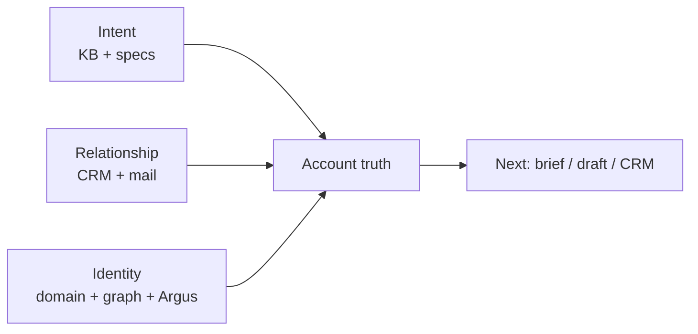
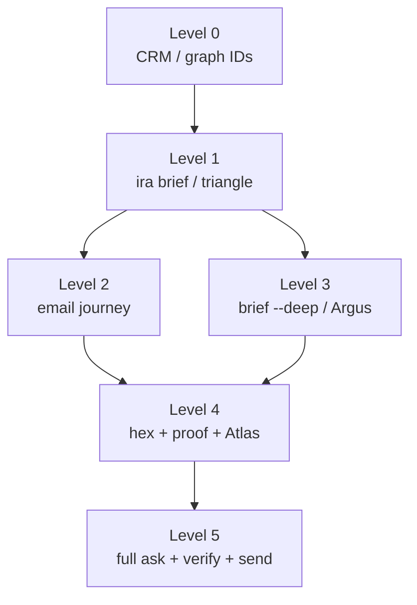

# Ira triangulation and hexagolation

How to get ImportYeti-quality convergence inside Ira: independent evidence legs that must agree before you label, draft, or send.

This runbook is the **operational form** of [SOUL.md](../SOUL.md) **Philosophical Foundation** — especially **Anekantavada** (many-sided truth; no single source) and **Syadvada** (cite the facet you used; state gaps). See [AGENTS.md](../AGENTS.md) § SOUL in operations.

**Stable mode #14:** [stable_modes.md](stable_modes.md). **Cursor rule:** [.cursor/rules/ira-triangulation.mdc](../.cursor/rules/ira-triangulation.mdc).

## ImportYeti analogy

| ImportYeti | Ira |
|:-----------|:----|
| HS codes (product class) | **Intent** — machine, material, thickness, application; quotes/PDFs; lead CSV; scrape |
| Named Asian shippers (supply anchor) | **Relationship** — CRM stage, deals, Gmail sent/received, Active-21 / hot board |
| Suspected US consignees (demand hypothesis) | **Identity** — company + domain, Neo4j, Argus dossier |

Weak answers usually miss a leg: name without mail, draft without proof, or "lead" while Atlas shows active production.

## Triangle (default)



**Commands**

```bash
poetry run ira brief "Acme Corp" --contact jane@acme.com --json
poetry run ira brief "Acme Corp" --deep --json   # adds Argus when configured
```

MCP: `get_account_brief`. Schema: `src/ira/schemas/account_brief.py` (`crm`, `mail`, `kb_highlights`, `proof_links`, `precedents[]`, `sources[]`).

**Precedents (context graph):** Each `ira brief` / `get_account_brief` records an operator context run and surfaces up to five prior runs for the same company (brief, Tinder draft, quote prep). Tinder **send** marks the latest draft run as `sent`; **`ira praise --run-id …`** marks linked runs successful. Pass **`--run-id`** from `ira ask --json` on `ira brief` / MCP `get_account_brief(run_id=…)` to link operator context to pipeline run records. Tinder drafts inject precedents into Calliope via the triangulation block. SQLite: `data/brain/operator_context.sqlite` (`APP__OPERATOR_CONTEXT_*`). Optional Neo4j mirror (P1): `APP__OPERATOR_CONTEXT_NEO4J_SYNC=true` — `Company-[:HAS_CONTEXT_RUN]->OperatorContextRun`, `Company-[:HAS_PIPELINE_RUN]->PipelineRun`, evidence refs on `PipelineRun`, links `OperatorContextRun-[:FROM_PIPELINE|CONTEXT_FOR_PIPELINE]->PipelineRun`. Implementation: `src/ira/brain/context_graph_sync.py`, `src/ira/services/operator_context.py`. **P2 (1-hop expansion):** `APP__OPERATOR_CONTEXT_GRAPH_EXPAND_ENABLED=true` (default) adds `graph_context_lines` on briefs and company-scoped retriever hits — contacts, quotes, operator/pipeline runs within one hop — via `src/ira/brain/context_graph_expand.py`. Full runbook: [CONTEXT_GRAPH.md](CONTEXT_GRAPH.md).

For long-thread relationships (multi-year, attachment-heavy): run account journey first, then triangle/hex:

```bash
poetry run ira email journey --company "Acme Corp" --contact jane@acme.com --json
```

Equivalent surfaces: MCP `get_account_mail_journey`, API `POST /api/email/account-journey`.
This emits a meeting-context packet (`current_need`, constraints, objections, agenda) plus chronology artifacts.

## Hexagon (revenue / outbound)

| # | Leg | Tool / agent |
|:-:|:----|:-------------|
| 1 | Intent | Clio / `search_knowledge` |
| 2 | Relationship | Prometheus + Gmail |
| 3 | Identity | Argus, `find_company_contacts` |
| 4 | Production | Atlas (+ Asclepius if quality blocks) |
| 5 | Graph | Neo4j quotes / contacts |
| 6 | Policy | `outbound_proof_artifacts`, Mnemon corrections |

**Evidence-first outbound** (AGENTS.md): Prometheus → optional Argus → Clio/proof → Calliope; Aletheia/Vera on the way out.

```bash
poetry run ira revenue persuade -c "Acme Corp" --json
```

Draft only until explicit **send**. See [PERSUASION_SPRINT.md](PERSUASION_SPRINT.md).

## Context budget and cascade

Long mailboxes, large KB hits, and multi-agent ReAct all behave like **long context**: cost grows when you let every tool see everything. Ira’s answer is not a bigger window — it is a **cascade**: coarse evidence first, a **fixed budget** gather, then the expensive LLM step only on that pack.

This is the same shape as [selection-based hierarchical attention](https://nousresearch.com/lighthouse-attention) (pyramid pool → top-K → dense attention on the gather → optional full-attention resume). Ira does not implement that kernel; operators use the cascade below.

### Mental model

| Symbol | Ira meaning |
|:-------|:------------|
| **N** | Full history available (Gmail threads, KB corpus, CRM timeline, graph neighborhood) |
| **S** | Bounded pack passed to agents (account brief, journey summary, top-K retrieval, precedents) |
| **Expensive step** | `ira ask` / `query_ira`, ReAct loops, Calliope draft, dual faithfulness, `--deep` Argus |

**Goal:** keep **S ≪ N** on routine turns; escalate to a larger S or full pipeline only when the action warrants it (send, quote, dispute, board prep).

### Cascade levels (default operator path)

| Level | Gather (S) | Primary tools | Use when |
|:-----:|:-------------|:----------------|:-----------|
| **0** | CRM + graph IDs only | `ira brief … --no-llm --skip-mail` | Offline smoke, domain already known |
| **1** | **Triangle pack** | `ira brief` / `get_account_brief` | Default account prep, call coaching, Tinder card |
| **2** | **Relationship chronology** | `ira email journey` / `get_account_mail_journey` | Multi-year account, attachment-heavy, >~30 threads (see Gmail review rule) |
| **3** | **Identity depth** | `ira brief --deep`, `ask_agent` (**argus**) | Thin CRM, cold domain, wrong company match risk |
| **4** | **Hexagon** | Atlas check, `find_company_quotes`, proof registry, Mnemon | Before outbound, quote pack, `ira revenue persuade` |
| **5** | **Dense resume** | Full `ira ask`, Vera on prices, faithfulness (not heuristic-only) | User-approved **send**, legal/commercial dispute, “must be right” |

**Rules**

1. **Climb one level at a time** — do not open level 5 if level 1 still has UNVERIFIED triangle legs.
2. **Selection outside the pipeline** — use level-1 **front doors** ([MCP_OPERATOR_GUIDE.md](MCP_OPERATOR_GUIDE.md)); do not replace `get_account_brief` with five `search_emails` + `query_ira` calls that re-read the same threads.
3. **Symmetric legs** — the brief pack should balance **Intent, Relationship, Identity** (and hex legs at level 4). Relationship-only cascades (mail dump without KB/domain) are the analogue of asymmetric sparse attention: fast but misaligned for drafting.
4. **Dense resume** — a cheap brief path must still be able to escalate: `--deep`, full hex, and non-heuristic faithfulness before **send**. If sparse prep hollowed out quality, level 5 is where you recover (same role as Lighthouse’s SDPA-resume tail).



### Fixed K budgets (where S is capped in code)

| Surface | Default cap | Config / notes |
|:--------|:------------|:---------------|
| Account brief KB highlights | 5 hits | `UnifiedRetriever.search(…, limit=5)` in brief builder |
| Proof artifacts on brief | 5 | `match_artifacts(…, limit=5)` |
| Operator precedents | 5 | `APP__OPERATOR_CONTEXT_PRECEDENT_LIMIT` (default 5) |
| Graph expand on brief | 1-hop | `APP__OPERATOR_CONTEXT_GRAPH_EXPAND_ENABLED` |
| Similar companies (P3) | 5 peers | `APP__COMPANY_SIMILARITY_LIMIT` |
| Mailbox journey scan | 500 msgs / 120 threads | `APP__ACCOUNT_JOURNEY_MAX_MESSAGES`, `APP__ACCOUNT_JOURNEY_MAX_THREADS` |
| Journey in brief narrative | last 8 events | Brief builder slice of journey events |
| ReAct per agent | 8 iterations | `APP__REACT_MAX_ITERATIONS` — multiplies cost if level 1 skipped |
| Parallel agents | 5 | `APP__MAX_PARALLEL_AGENTS` |

Raising K without a named gap wastes tokens; lowering K without stating **UNVERIFIED** risks hollow drafts.

### Mailbox review cascade (Cursor / operator)

For correspondence review at scale, mirror level 2 before full thread text:

1. Query `from:{email} OR to:{email}`; prefer **`has:attachment`** first when the mailbox is large (>30 threads → confirm scope with operator).
2. Chronological thread list — subjects, dates, quote hints, attachment **filenames only**.
3. **`read_email_thread` / full thread** only for threads that change status, pricing, or next steps.

Do not download attachments without explicit approval. Full rule: [.cursor/rules/ira-gmail-correspondence-review.mdc](../.cursor/rules/ira-gmail-correspondence-review.mdc).

### Retrieval cascade (KB)

| Stage | Mechanism |
|:------|:----------|
| Coarse | Category filters, company-scoped graph lines, Alexandros metadata |
| Dense + sparse | Qdrant hybrid (`APP__USE_SPARSE_HYBRID`) — keyword + semantic, then RRF |
| Fine | Rerank top-K (`rerank-2.5` / FlashRank) before the agent sees chunks |

Parent–child / hierarchical chunks (coarse deal summary → fine quote text) are the ingest-side pyramid; see [INGESTION_STATE_OF_THE_ART.md](INGESTION_STATE_OF_THE_ART.md).

### Anti-patterns

| Pattern | Why it fails |
|:--------|:-------------|
| `query_ira` on a named account without `ira brief` first | Pays **N** (full pipeline + ReAct) to rebuild **S** |
| Multiple agents each calling `search_emails` on the same domain | No shared gather; **S** duplicated per agent |
| `ira brief` then immediate **send** with hex legs empty | Skipped level 4–5 recoverability |
| `APP__FAITHFULNESS_HEURISTIC_ONLY=true` during send week | Saves tokens but removes dense resume on claims |
| Unbounded journey on every brief | Use level 2 only when relationship depth matters |

Token presets tied to cascade depth: [LLM_COST_OPTIMIZATION.md](LLM_COST_OPTIMIZATION.md) § Context cascade and presets.

## EV / supply-chain lists

External manifests (ImportYeti CSV, Places, Firecrawl) are not native tools. Flow:

1. Ingest or `ira leads enrich-from-csv` → domains.
2. **Triangle** each priority row.
3. **Hex** before any outbound.

Map columns: process/material → **Intent**; known tier-1/OEM → **Relationship** anchor in graph/KB; US site/domain → **Identity**.

## When triangle vs hex

| Goal | Use |
|:-----|:----|
| "Who is X?" / call prep | Triangle (`ira brief`) |
| Cold email / quote / re-engage | Hex + persuasion or workflow pack |
| **Tinder swipe-right draft** | Triangle auto (`ira tinder draft`; gaps in JSON) |
| Inbox archaeology at scale | Artemis; single domain → Argus |
| Batch NA leads | enrich → score → brief top N → persuade |

### Tinder mode

Before a card is shown, **ICP gate** (`APP__TINDER_ICP_GATE_ENABLED`, default true) classifies the domain (cached site profile + optional scrape + `ThermoformerLeadClassification`). Non-buyers at confidence ≥ `APP__TINDER_ICP_AUTO_SKIP_MIN_CONFIDENCE` (default 0.85) are auto-skipped (`left` with note). Company card shows **ICP verdict**; `ira tinder draft` requires `icp_approved`.

On **right draft**, Ira runs the triangle plus **ICP buyer-fit** (`icp_buyer_fit` leg) and passes gaps to Calliope. Config: `APP__TINDER_TRIANGULATE_BEFORE_DRAFT` (default true), `APP__TINDER_TRIANGULATE_DEEP` (Argus, default false). CLI: `ira tinder draft --no-triangulate` to skip; `--deep` for Argus; `ira tinder start --no-icp-gate` to disable classifier.

## Enforcement (outbound + pipeline)

| Surface | Behavior | Config |
|:--------|:---------|:-------|
| `ira ask` / API query (account-shaped) | Appends **gaps-only** table after shape | `APP__PIPELINE_TRIANGULATION_GAPS_ENABLED` (default **true**); `APP__PIPELINE_TRIANGULATION_GAPS_HEX` for hex legs |
| MCP `draft_email`, `POST /api/email/draft` | **Hex** brief + **block** when legs missing | `APP__TRIANGULATION_ENFORCE_BEFORE_OUTBOUND_DRAFT`, `APP__TRIANGULATION_BLOCK_ON_GAPS`, `APP__TRIANGULATION_HEX_FOR_OUTBOUND_DRAFT` |
| `persuasion_sprint` / `ira revenue persuade` | Same hex gate before Calliope | same |
| `prepare_machinecraft_quote` | Same hex gate before quote pack | same |
| `ira crm blast-from-the-past draft-batch` | Brief + `triangulation_gaps` / `triangulation_ready` per row (warn, no block) | — |

Override: API `skip_triangulation=true`; MCP `draft_email` context containing `skip_triangulation`. Implementation: `src/ira/services/triangulation_enforcement.py`.

Consumer inboxes (gmail.com, etc.) with no company hint skip the gate (personal one-offs).

## Related docs

- [stable_modes.md](stable_modes.md) §9 Account brief, §8 Revenue sprint
- [CURSOR_WORKFLOWS.md](CURSOR_WORKFLOWS.md) — lifecycle and MCP
- [IRA_TRUST_PROVENANCE_AND_PROOF.md](IRA_TRUST_PROVENANCE_AND_PROOF.md) — proof registry
- [LLM_COST_OPTIMIZATION.md](LLM_COST_OPTIMIZATION.md) — ReAct / parallel caps vs cascade level
- [CONTEXT_GRAPH.md](CONTEXT_GRAPH.md) — precedents, 1-hop expand, similar companies
- [MCP_OPERATOR_GUIDE.md](MCP_OPERATOR_GUIDE.md) — triangulation front doors
