# Ira request pipeline — public executive summary

> **Public edition** for ira-universe. Full branch taxonomy, risk tables, and code-level audit live in the private operator repository.

**Scope:** The 17-step `RequestPipeline` — perceive → route → execute → safety gates → shape → learn.
**Audience:** Architects evaluating Ira's safety ordering and bounded execution.
**Aligned with:** `docs/TIMEOUT_MODEL.md`, `AGENTS.md` (Request Pipeline).

---

## 1. Executive summary

The pipeline is a **single linear orchestrator** with **many intentional early exits** and **heavy optional enrichment**.

**Strengths**

- Layered routing: fast path → truth hints → procedural memory → LLM (Athena).
- Explicit safety passes after agents run: **Aletheia** (provenance) → **Aegis** (DLP) → **Mnemon** (corrections) → **Gapper** (missing facts) → **faithfulness** → **guardrails**.
- Outreach-specific grounding and validation where configured.
- **Background LEARN** so the user-facing response returns before all durable writes finish.

**Design trade-offs (honest)**

- Duplicate retrieval can occur across faithfulness, metacognition, and agents.
- Dedup layers can surprise operators if the same query is retried quickly.
- Gapper-filled content may not always be re-scanned by DLP in every branch.
- Many inner steps have their own timeouts (Sphinx, prefetch, retrievers) inside the total budget — see `docs/TIMEOUT_MODEL.md`.
- Soft-fail paths continue with degraded behavior unless logs are watched.

---

## 2. Architecture map (simplified)

Every chat/API turn enters an outer **wait-for** budget, a **concurrency semaphore** (typically five parallel pipeline runs), then a monolithic inner path:

```mermaid
flowchart LR
  subgraph ingress
    D[Dedup]
    CR[Clarification resume]
  end
  subgraph core
    P[PERCEIVE]
    R[REMEMBER]
    FP[FAST PATH]
    SP[SPHINX]
    RF[Route Fast / Proc / LLM]
    EN[ENRICH]
    EX[EXECUTE agents]
  end
  subgraph safety
    AL[Aletheia]
    AE[Aegis]
    MN[Mnemon]
    GA[Gapper]
    FA[Faithfulness]
    GU[Guardrails]
  end
  subgraph out
    MC[Assess]
    IV[Reflect]
    VO[SHAPE voice]
    GR[Session log]
    ME[Metis quality]
    LN[LEARN background]
  end
  D --> CR --> P --> R --> FP
  FP -->|miss| SP --> RF --> EN --> EX
  EX --> AL --> AE --> MN --> GA --> FA --> GU --> MC --> IV --> VO --> GR --> ME --> LN
```

**Early exits** (skip full agent graph): dedup hit, fast-path greeting/identity, CRM quick summary, Sphinx clarify-only return, truth-hint canned answers.

**Authoritative step list:** `AGENTS.md` → *Request Pipeline (17 steps)* and `docs/ARCHITECTURE.md`.

---

## 3. What to read next

| Doc | Topic |
|:----|:------|
| `docs/TIMEOUT_MODEL.md` | Total, per-agent, synthesis, ReAct depth |
| `docs/IRA_TRIANGULATION.md` | Evidence before outbound |
| `docs/CURSOR_AGENTIC_LOOP.md` | How Cursor mirrors Explore → Think → Act → Result |
| `docs/IRA_BIRTH_CERTIFICATE.md` | Identity, body metaphor, pantheon |
